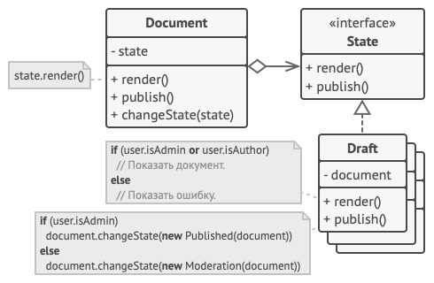

# Чащина Ксения Владимировна ИВТ-1.2

## Лабораторная работа № 4. Паттерны проектирования. Состояние

### Теория

***Состояние (State)*** — это поведенческий паттерн проектирования, который позволяет объектам менять поведение в зависимости от своего состояния. Извне создаётся впечатление, что изменился класс объекта

Основная идея в том, что программа может находиться в одном из нескольких состояний, которые всё время сменяют друг друга. Набор этих состояний, а также переходов между ними, предопределён и конечен. Находясь в разных состояниях, программа может по-разному реагировать на одни и те же события, которые происходят с ней

Машину состояний чаще всего реализуют с помощью множества условных операторов, `if` либо `switch`, которые проверяют текущее состояние объекта и выполняют соответствующее поведение

``` python
class Document is
    field state: string
    // ...
    method publish() is
        switch (state)
            "draft":
                state = "moderation"
                break
            "moderation":
                if (currentUser.role == "admin")
                    state = "published"
                break
            "published":
                // Do nothing.
                break
    // ...
```

Основная проблема такой машины состояний проявится в том случае, если добавить ещё десяток состояний. Каждый метод будет состоять из увесистого условного оператора, перебирающего доступные состояния. Такой код крайне сложно поддерживать. Малейшее изменение логики переходов заставит вас перепроверять работу всех методов, которые содержат условные операторы машины состояний

Паттерн *Состояние* предлагает создать отдельные классы для каждого состояния, в котором может пребывать объект, а затем вынести туда поведения, соответствующие этим состояниям

Вместо того, чтобы хранить код всех состояний, первоначальный объект, называемый контекстом, будет содержать ссылку на один из объектов-состояний и делегировать ему работу, зависящую от состояния


_ _ _

