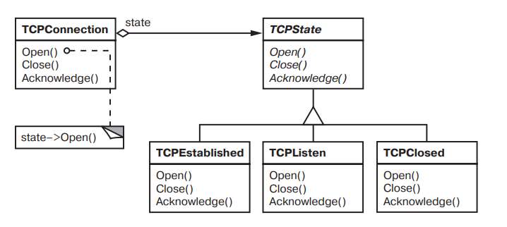

# Чащина Ксения Владимировна ИВТ-1.2

## Лабораторная работа № 4. Паттерны проектирования. Состояние

### Теория

***Состояние (State)*** — это поведенческий паттерн проектирования, который позволяет объектам менять поведение в зависимости от своего состояния. Извне создаётся впечатление, что изменился класс объекта

Основная идея в том, что программа может находиться в одном из нескольких состояний, которые всё время сменяют друг друга. Набор этих состояний, а также переходов между ними, предопределён и конечен. Находясь в разных состояниях, программа может по-разному реагировать на одни и те же события, которые происходят с ней

Машину состояний чаще всего реализуют с помощью множества условных операторов, `if` либо `switch`, которые проверяют текущее состояние объекта и выполняют соответствующее поведение

``` python
class Document is
    field state: string
    // ...
    method publish() is
        switch (state)
            "draft":
                state = "moderation"
                break
            "moderation":
                if (currentUser.role == "admin")
                    state = "published"
                break
            "published":
                // Do nothing.
                break
    // ...
```

Основная проблема такой машины состояний проявится в том случае, если добавить ещё десяток состояний. Каждый метод будет состоять из увесистого условного оператора, перебирающего доступные состояния. Такой код крайне сложно поддерживать. Малейшее изменение логики переходов заставит вас перепроверять работу всех методов, которые содержат условные операторы машины состояний

Паттерн *Состояние* предлагает создать отдельные классы для каждого состояния, в котором может пребывать объект, а затем вынести туда поведения, соответствующие этим состояниям

Вместо того, чтобы хранить код всех состояний, первоначальный объект, называемый контекстом, будет содержать ссылку на один из объектов-состояний и делегировать ему работу, зависящую от состояния

- Схема, представленная на сайте [Refactoring.Guru](https://refactoringu.ru/ru/design-patterns/state.html)


- Схема, представленная в книге ["Паттерны объектно-ориентированного проектирования" Гамма Э., Хелм Р., Джонсон Р., Влисседес Дж.](https://library.tsilikin.ru/%D0%A2%D0%B5%D1%85%D0%BD%D0%B8%D0%BA%D0%B0/%D0%9F%D1%80%D0%BE%D0%B3%D1%80%D0%B0%D0%BC%D0%BC%D0%B8%D1%80%D0%BE%D0%B2%D0%B0%D0%BD%D0%B8%D0%B5/Desing/%D0%9F%D0%B0%D1%82%D1%82%D0%B5%D1%80%D0%BD%D1%8B%20%D0%9E%D0%9E%D0%9F.pdf)



***Компоненты***

| Компонент | Роль |
|-----------|------|
| *Context* | Хранит ссылку на текущее состояние. Делегирует вызовы состоянию. |
| *State* | Интерфейс, объявляющий методы для всех состояний. |
| *ConcreteState* | Реализует поведение, специфичное для своего состояния. |

***Принцип работы***

1. Клиент вызывает метод контекста
2. Контекст делегирует вызов текущему состоянию
3. Состояние выполняет свою логику
4. При необходимости — меняет состояние контекста
_ _ _

### Практика

***Задача:*** Разработать программу для библиотеки, которая управляет выдачей книг читателям. У книги может быть несколько состояний: «в наличии», «нет в наличии», «у читателя на руках», «забронирована читателем». В зависимости от текущего состояния меняются доступные действия (выдать, забронировать, вернуть, продлить) и их результат

***Основные состояния***

| Статус | Класс в коде | Описание | Условие появления |
|--------|--------------|----------|-------------------|
| *В наличии* | `AvailableState` | Книга в библиотеке, доступна для выдачи или бронирования | Книга не у другого читателя и не забронирована |
| *Нет в наличии* | `UnavailableState` | Книга временно недоступна | Книга у другого читателя или забронирована другим |
| *У вас на руках* | `BorrowedByUserState` | Книга находится у текущего читателя | Читатель получил книгу (по брони или напрямую) |
| *Забронировано вами* | `ReservedByUserState` | Книга зарезервирована за текущим читателем | Читатель забронировал книгу, но еще не получил |

***Подсостояния `BorrowedByUserState` (в зависимости от дней владения)***

| Дней | Статус (отображаемый) | Условие | Продление |
|------|----------------------|---------|-----------|
| 0–11 | `У вас на руках (дней с момента выдачи: {days})` | `days < 12` | Запрещено |
| 12–13 | `У вас на руках (приближается срок сдачи - {14-days} дня)` | `12 ≤ days < 14` | Запрещено |
| 14 | `Можно продлить` | `days == 14` | Разрешено |
| 15+ | `Просрочена! Верните книгу` | `days > 14` | Запрещено (нужно вернуть и взять заново по необходимости) |

Полный код программы для примера можно посмотреть [тут](https://github.com/chashchina-ks/proga-4/blob/main/lab4/state_library.py)

